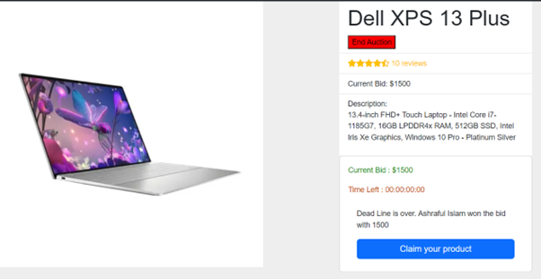
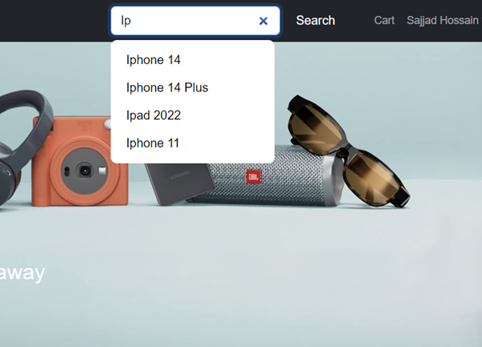
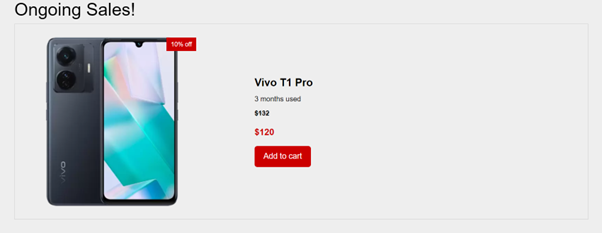
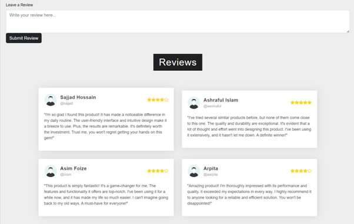
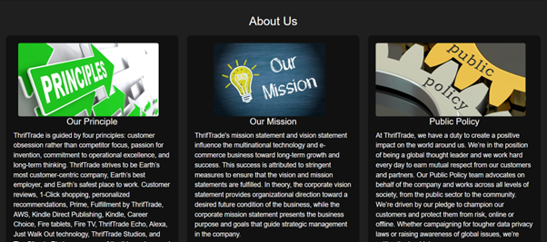
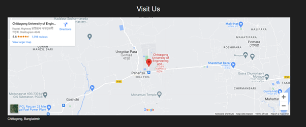

# TriftTrade - An ecommerce site

[](https://img.shields.io/github/v/release/navendu-pottekkat/awesome-readme?include_prereleases)
[](https://img.shields.io/github/last-commit/navendu-pottekkat/awesome-readme)
[](https://img.shields.io/github/issues-raw/navendu-pottekkat/awesome-readme)
[](https://img.shields.io/github/issues-pr/navendu-pottekkat/awesome-readme)
[](https://img.shields.io/github/license/navendu-pottekkat/awesome-readme)


ThriftTrade is a recommerce-based website offering an engaging experience for users to bid, browse, and explore products seamlessly. The platform includes the following features:


## Features

### 1. **Bidding Page**
The **Bidding Page** allows users to view detailed descriptions of auctioned products. Users can:
- View the current bid and remaining time for the auction.
- Place bids through the "Place a Bid" button.
- Win products if they have the highest bid when the timer ends.

Proper safety measures are implemented to prevent scammers from participating in bidding.



---

### 2. **Universal Search Bar**
The universal search functionality, built using React `useState`, enables users to:
- Search for products from any page on the website.
- View real-time suggestions by typing keywords in the search bar.
- Navigate to the corresponding product page by clicking on a suggestion.

This feature enhances user convenience and search efficiency.



---

### 3. **Offer Page**
The **Offer Page** showcases ongoing sales and promotions, such as:
- Flat discounts on selected products.
- Special occasion offers (e.g., Black Friday, Eid, Pooja).
- Stock clearance sales.



---

### 4. **Product Reviews**
Users can view and submit reviews for products to:
- Assess the authenticity and quality of items.
- Share their own experiences after purchasing products.



---

### 5. **About Us**
The **About Us** page outlines our:
- Principles and mission to create a positive global impact.
- Goals to lead the e-commerce sector in the future.
- Team’s vision for empowering recommerce through innovation.



---

### 6. **Visit Us**
The **Visit Us** section features an embedded Google Map, showing the address of our workplace.



---

## Tech Stack

### **Software**
- VS Code
- Google Chrome
- Git
- Postman
- MongoDB Compass

### **Languages & Frameworks**
- HTML
- CSS
- React-Bootstrap
- TypeScript
- ReactJS

---

## Installation and Setup
1. Clone the repository:
   ```bash
   git clone https://github.com/your-username/thrifttrade.git
   ```
2. Navigate to the project directory:
   ```bash
   cd thrifttrade
   ```
3. Install dependencies:
   ```bash
   npm install
   ```
4. Start the development server:
   ```bash
   npm start
   ```
5. Open [http://localhost:3000](http://localhost:3000) in your browser to view the application.

---

## Contributing
We welcome contributions to improve ThriftTrade! Please follow these steps:
1. Fork the repository.
2. Create a new branch for your feature:
   ```bash
   git checkout -b feature-name
   ```
3. Commit your changes:
   ```bash
   git commit -m "Add feature-name"
   ```
4. Push the branch:
   ```bash
   git push origin feature-name
   ```
5. Open a pull request and provide a detailed description.

---

## License
This project is licensed under the [MIT License](./LICENSE).

---

Thank you for choosing **ThriftTrade**! 🚀


